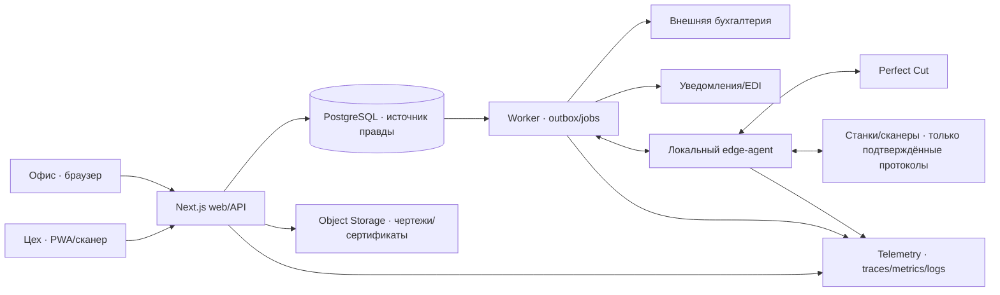
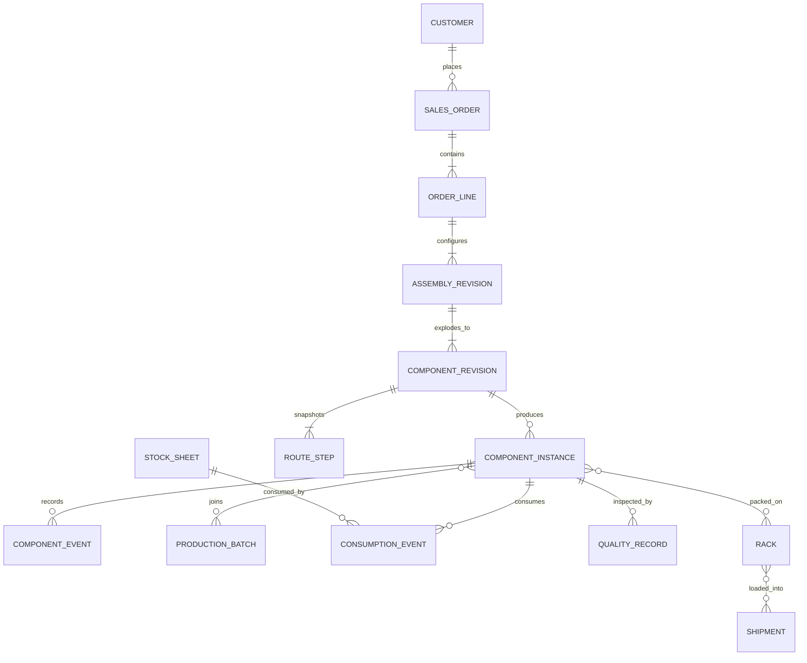

# GLASS ERP — глубокая целевая архитектура

Версия: 1.0 · 18 августа 2026
Статус: расширенный целевой контур одобрен владельцем 18 августа 2026; конкретные процессы, стек и порядок внедрения ещё требуют решений

Этот документ дополняет, но не заменяет `GLASS_ERP_HANDOFF.md`. Он специально разделяет:

- **зафиксировано** — решения, уже подтверждённые владельцем;
- **рекомендация** — мой предпочтительный вариант;
- **нужны данные** — решение нельзя честно принять без фактов с производства;
- **дальний контур** — возможности ERP без искусственного ограничения «средним рынком».

## 1. Короткий вывод

**Рекомендация:** строить не набор CRUD-экранов и не микросервисы, а **доменный модульный монолит** на Next.js + TypeScript + PostgreSQL, с отдельным worker и локальным edge-agent для оборудования. Для первой промышленной версии — управляемый PostgreSQL/Supabase; границы приложения и миграции делать переносимыми, чтобы база не зависела от одного поставщика.

Главный объект системы — не заказ и не строка заказа, а **физический компонент стекла с неизменяемой выпущенной ревизией, собственным серийным номером, маршрутом, происхождением материала и журналом событий**. Это даёт настоящую ERP/MES-прослеживаемость: от коммерческого предложения до листа, станка, контроля качества, стойки и отгрузки.

Не начинать с Kafka, Kubernetes и десятка сервисов. Глубина ERP создаётся корректной моделью, инвариантами и сквозными процессами, а не количеством технологий.

## 2. Решения, которые остаются зафиксированными

- Система создаётся с нуля; Spil Glass не становится новой основной моделью данных.
- Perfect Cut остаётся внешним оптимизатором раскроя. Собственный nesting engine не строится.
- Протокол Perfect Cut не выдумывается до получения реального образца обмена и настроек коннектора.
- Бухгалтерский ledger, payroll и налоги остаются во внешней бухгалтерии.
- Материал разделён на независимые оси: подложка, толщина, покрытие. Закалка, ламинация, покраска и другие изменения — процессы/обработка, а не «тип стекла».
- `component` не равен `order_line`: одна строка стеклопакета или ламинированного изделия разузловывается в несколько физических компонентов.
- Shape — единственный источник геометрии. Muntin ссылается на Shape и не заводит вторую ширину/высоту.
- Производственный журнал событий и права доступа являются фундаментом, а не поздней надстройкой.
- Целевой пользовательский интерфейс должен работать как PWA и выдерживать прерывистую сеть в цеху.

## 3. Три реалистичных варианта платформы

| Вариант | Состав | Сильные стороны | Цена сложности | Когда выбирать |
|---|---|---|---|---|
| **A. Supabase-first — рекомендован для старта** | Next.js, TypeScript, Supabase Postgres/Auth/Storage, отдельный Node worker, PWA, edge-agent | Самый быстрый путь к промышленному фундаменту; одна платформа для БД, входа, файлов и realtime; RLS | Нужно дисциплинированно не привязывать доменную логику к клиентскому SDK; отдельно резервировать файлы Storage | 1–2 завода, небольшая команда разработки, приоритет — быстро получить рабочий вертикальный поток |
| **B. Portable Postgres** | Next.js, Neon Postgres, OIDC-провайдер, S3-совместимое хранилище, worker, PWA, edge-agent | Меньше платформенной связанности; удобные ветки БД для тестов; компоненты можно менять независимо | Больше интеграций, секретов, мониторинга и эксплуатационной работы | Если переносимость и независимый выбор Auth/Storage важнее скорости сборки |
| **C. Hybrid/self-hosted** | Контейнеры в частном облаке/ЦОД, PostgreSQL HA, OIDC, S3/MinIO, reverse proxy, worker, локальный site gateway | Максимальный контроль данных, сети и оборудования; можно переживать потерю внешнего интернета на площадке | Самая высокая стоимость DevOps, обновлений, HA и аварийного восстановления | Только при подтверждённых требованиях к локальности данных, длительной автономности или корпоративной инфраструктуре |

### Почему вариант A — стартовый, а не пожизненная зависимость

Supabase даёт обычный PostgreSQL, Auth, Storage и RLS. Но промышленный контур должен соблюдать четыре правила:

1. Доменная логика живёт в `packages/domain` и серверных use-case, а не в React-компонентах и не в vendor-specific вызовах.
2. Схема управляется SQL-миграциями в Git.
3. Критические переходы состояния выполняются сервером в транзакции. Прямые browser-to-table записи допустимы только для узких безопасных сценариев.
4. Файлы чертежей и сертификатов имеют собственную политику резервного копирования: резервная копия базы Supabase не включает сами Storage-объекты.

PostgreSQL RLS даёт default-deny после включения без разрешающих policy; Supabase требует RLS на таблицах exposed schema и запрещает публиковать service-role ключ в браузер. Это защита в глубину, а не замена серверной авторизации: [PostgreSQL RLS](https://www.postgresql.org/docs/current/ddl-rowsecurity.html), [Supabase RLS](https://supabase.com/docs/guides/database/postgres/row-level-security), [Supabase security](https://supabase.com/docs/guides/database/secure-data).

### Почему не микросервисы сейчас

При 10–100 заказах в день основная сложность — транзакционная целостность между заказом, компонентами, резервом материала, маршрутом, событием и себестоимостью. Модульный монолит позволяет фиксировать это одной транзакцией. Границы доменов всё равно должны быть строгими; выделение сервиса возможно позже по фактической нагрузке или независимому жизненному циклу.

Первым отдельным процессом нужен **worker**, потому что импорт файлов, генерация документов, интеграции и повторные попытки не должны выполняться внутри HTTP-запроса. Вторым — **edge-agent**, потому что облачная ERP не должна напрямую видеть локальную сеть станков.

## 4. Целевая схема исполнения



### Рекомендуемая структура будущего репозитория

```text
apps/
  web/                 Next.js: UI, API/BFF, серверные use-case
  worker/              outbox, импорты, документы, интеграции, retries
  edge-agent/          локальный подписанный агент Perfect Cut/оборудования
packages/
  domain/              сущности, value objects, state machines, политики
  application/         команды, запросы, транзакционные use-case
  contracts/           versioned DTO, JSON Schema/OpenAPI, event contracts
  geometry/            перенесённые Shape/Muntin + property/golden tests
  authz/               единая матрица permissions и field policies
  observability/       trace context, structured logging, metrics
db/
  migrations/          только последовательные миграции
  seeds/               справочники без реальных персональных данных
  policies/            RLS и проверочные permission tests
docs/
  adr/                 Architecture Decision Records
  runbooks/            backup/restore, outage, bridge recovery
```

Next.js App Router допускает управляемый и self-hosted запуск; при self-hosting официальная документация рекомендует reverse proxy и отдельно предупреждает о координации cache между несколькими инстансами: [Next.js self-hosting](https://nextjs.org/docs/app/guides/self-hosting). Поэтому производственные экраны не должны полагаться на неявный HTML cache для актуальности WIP.

## 5. Доменные границы

### 5.1 Identity, организация и площадки

- `organization`, `site`, `department`;
- `user`, `employee`, `role`, `permission`, `user_role`;
- `work_center`, `machine`, `device`, `station_terminal`;
- `shift`, `work_calendar`, `downtime_calendar`, `skill`, `employee_skill`;
- членство пользователя по площадкам и разрешённым складам;
- device identity отдельно от employee identity.

Пользователь, сотрудник и устройство — разные сущности. Один сотрудник может не иметь учётной записи; один терминал используют несколько операторов; интеграционный агент не является «админом».

### 5.2 Master Data и инженерные спецификации

- `substrate` — float/low-iron/mirror и производитель;
- `thickness` — отдельная справочная ось;
- `coating` — код, сторона, применимость, ограничения обработки;
- `material_variant` — допустимая комбинация осей, а не свободный текст;
- `treatment`, `service`, `process_spec`;
- `edge_finish`, `hole/notch/cutout`, `muntin_profile`, `spacer`, `sealant`, `gas`;
- `product_family` — monolithic, IGU, laminated, tempered, spandrel, silk-screen и реально используемые варианты;
- `routing_template` и versioned capability rules;
- единицы, валюты, налоги, допуски и правила округления.

`material_variant` отвечает на вопрос «что лежит на складе». `process_spec` — «что с ним нужно сделать». Нельзя создавать SKU вроде `Clear 6mm Tempered` и одновременно считать tempering операцией: это снова смешает материал и маршрут.

### 5.3 CRM, CPQ и продажи

- `customer`, `customer_site`, `contact`, `credit_profile`;
- `quote`, `quote_revision`, `quote_line`, `price_snapshot`;
- `order`, `order_revision`, `order_line`;
- `product_configuration`, `assembly`, `assembly_layer`;
- `shape_revision`, `drawing_revision`, `line_service`, `customer_requirement`;
- `commercial_approval`, `technical_approval`, `acknowledgement`;
- адреса объектов, ship-to, requested date, promised date, delivery window;
- customer-specific price lists, contracts, minimum charges and surcharge rules.

Цена в выпущенном предложении хранится snapshot-ом. Пересчёт прайс-листа завтра не меняет принятую клиентом ревизию вчера. Изменение выпущенного заказа создаёт revision/change order с причиной и повторным approval, а не перезаписывает историю.

### 5.4 Product Engineering и разузлование

После технического выпуска строки заказа создаются:

- `component_definition` — инженерное определение детали;
- `component_revision` — неизменяемая выпущенная версия;
- `component_instance` — физическая единица или контролируемая партия одинаковых единиц;
- `component_relation` — слой/дочерняя деталь/замена/remake-of;
- `route_snapshot` — маршрут, замороженный на момент выпуска;
- `route_step` — конкретная операция с допусками и work-center capability;
- `production_document` — shop drawing/label payload/инструкция.

Пример: строка «IGU, qty 5» не превращается в одну запись с `qty=5`. Она даёт сборочную спецификацию, десять листов стекла, spacer/sealant/gas requirements и пять готовых сборок. У каждого листа может быть свой remake и материал lot, не меняющий историю остальных.

### 5.5 Planning / APS-lite

- `demand`, `supply`, `reservation`;
- `work_order`, `operation`, `operation_assignment`;
- `production_batch` и тип батча: cutting, furnace load, autoclave, IGU line, delivery;
- `capacity_bucket`, `machine_calendar`, `setup_family`;
- finite-capacity dispatch board;
- правила совместимости по толщине, покрытию, размеру, температурной рецептуре и сроку;
- обещанная дата (`capable-to-promise`) с зафиксированными причинами риска.

Начать нужно не с «идеального оптимизатора графика», а с прозрачной очереди работ, ограничений станков, смен и батчей. Автоматический APS разрешается предлагать диспетчеру; выпуск/перепланирование критической партии остаётся подтверждаемым действием.

### 5.6 MES / Production Execution

- `operation_status`: ready, queued, started, paused, completed, failed, scrapped, held;
- `component_event` — append-only факт сканирования/перехода;
- `labor_session`, `machine_session`, `downtime_reason`;
- `consumption_event`, `output_event`, `scrap_event`;
- `hold`, `release`, `rework`, `remake_order`;
- `batch_membership` с историей добавления/удаления;
- идентификаторы этикеток, устройств и операторов;
- электронная подпись/approval для критических шагов.

Текущие статусы для быстрого экрана хранятся отдельно, но изменяются только той же транзакцией, которая добавляет событие. События не редактируются; исправление создаёт компенсирующее событие с ссылкой на исходное.

### 5.7 Inventory / WMS для листового стекла

- `inventory_item`, `lot`, `stock_sheet`;
- `offcut` с точной геометрией, material lot, coating side и quality grade;
- `warehouse`, `zone`, `rack`, `slot`, `container`;
- `stock_move`, `reservation`, `allocation`, `cycle_count`;
- quarantine, blocked, available, reserved, consumed, scrapped;
- supplier certificate/heat/batch, received dimensions and measured defects;
- переоценка usable area, срок хранения материалов, FIFO/FEFO там, где применимо;
- rack/container genealogy до машины и отгрузки.

Остаток — не просто число квадратных футов. Лист и обрезь имеют форму, размеры, ориентацию покрытия, местоположение, lot, качество и ограничения повторного использования. Фактический расход возвращается из Perfect Cut только после подтверждённого протокола.

### 5.8 Purchasing / MRP

- `supplier`, `supplier_item`, lead time, MOQ, pack/pallet;
- `purchase_requisition`, approval, `purchase_order`, revision;
- `inbound_shipment`, `goods_receipt`, discrepancy;
- supplier lot/certificate и incoming inspection;
- planned order suggestions из demand/supply, без автоматической отправки поставщику на первом этапе;
- substitute material — только через техническое правило и approval;
- supplier performance: OTIF, quality, price variance.

### 5.9 Quality Management

- `inspection_plan`, `inspection_characteristic`, `measurement`;
- incoming, in-process и final inspection;
- `nonconformance` (NCR), disposition, root cause;
- rework/remake/scrap с виновной причиной, стоимостью и approval;
- CAPA для повторяющихся проблем;
- calibration registry измерительных средств;
- фото/видео дефекта, чертёж и сертификат как versioned attachments;
- правила удержания всей связанной партии при критическом дефекте.

Remake — не новая безымянная деталь. Она ссылается на исходный component, причину, шаг обнаружения, material consumption и финансовое влияние. Так появляется реальная genealogy брака.

### 5.10 Shipping, racks и доставка

- `shipment`, `load`, `stop`, `delivery_window`;
- reusable `rack`, владение, залог, текущее местоположение и возврат;
- упаковочная иерархия: component → pack/crate → rack → load;
- scan verification против wrong-load/wrong-rack;
- POD, фото, подпись, shortage/damage;
- delivery route — интеграция с внешней картографией, а не самописная навигация;
- готовность заказа считается по физическим компонентам, quality release и комплектности, а не только по статусу order.

### 5.11 Costing и бухгалтерский адаптер

ERP считает управленческую и производственную себестоимость:

- material planned/actual;
- yield, offcut credit и scrap;
- labor/setup/machine burden;
- purchased services, freight, remake cost;
- price/margin snapshot и variance;
- WIP valuation согласно выбранной политике.

Во внешнюю бухгалтерию уходят утверждённые документы/проводочные события через адаптер: customer, invoice/credit memo, vendor bill/receipt, payment status при необходимости. ERP не становится вторым General Ledger.

## 6. Ключевая модель данных



### Обязательные технические поля

У большинства бизнес-таблиц:

- `id uuid` — внутренний идентификатор;
- `organization_id`, `site_id` — явная область владения;
- `business_number` — человекочитаемый номер, не primary key;
- `created_at`, `created_by`, `updated_at`, `updated_by`;
- `version bigint` — optimistic concurrency;
- `status` — контролируемая state machine;
- `released_revision_id` или `effective_from/effective_to` для versioned master data;
- архивирование, а не физическое удаление выпущенных объектов.

### Точность чисел

- Геометрия хранится в `numeric`, не IEEE float. Рекомендация: канонический `numeric(14,6)` в миллиметрах плюс `input_value`, `input_unit` и исходная строка, если её нужно показать оператору.
- Деньги — `numeric(18,4)` + ISO currency; никаких JS float для итогов счета.
- Время — UTC instant + `site.timezone`; локальное время смены не заменяет timestamp.
- Количество — отдельная precision по типу: штуки integer, длина/площадь/масса numeric.
- Shape хранит versioned геометрическую спецификацию и результат валидации; производственный release запрещён при invalid result.

### Ограничения в самой базе

- положительные размеры и количества;
- уникальные business-number в пределах организации/площадки;
- FK для всех ссылок genealogy;
- check constraints на разрешённые состояния и диапазоны;
- exclusion/unique constraints против двойного active reservation там, где это возможно;
- released revision неизменяема trigger/policy;
- события append-only;
- сумма распределений не может превышать доступное количество;
- crossing site boundary запрещён, кроме явного inter-site transfer.

UI-валидация нужна для удобства. Инварианты в API и БД нужны для сохранности производства.

## 7. Команды, события и интеграционная надёжность

### Команда

Каждая изменяющая операция получает:

- `command_id` UUID;
- `idempotency_key`;
- actor/user/device;
- expected aggregate version;
- reason/comment для критических переходов;
- timestamp клиента и timestamp сервера.

Повторная отправка из offline-очереди с тем же ключом возвращает прежний результат, а не создаёт второе completion или второй расход листа.

### Transactional outbox

Изменение бизнес-состояния и запись `outbox_event` выполняются одной транзакцией PostgreSQL. Worker забирает outbox, доставляет интеграцию, пишет попытки и результат. После ошибки используется exponential backoff, dead-letter состояние и ручной replay с тем же idempotency key.

Не делать сетевой вызов бухгалтерии или Perfect Cut внутри транзакции заказа. Внешняя система может быть недоступна, но ERP обязана сохранить согласованное локальное состояние.

### Не чистый event sourcing

Рекомендация — обычная реляционная модель текущего состояния + неизменяемые доменные события. Полный event sourcing увеличит сложность восстановления, миграций и отчётов без доказанной пользы для текущего масштаба.

## 8. Perfect Cut и оборудование

### Граница адаптера

Внутренний versioned контракт ERP может быть определён уже сейчас:

- `CuttingBatchRequested` — material variant, sheet constraints, component revision, qty, shape reference, treatment/service requirements;
- `CuttingBatchAccepted/Rejected`;
- `CuttingResultReceived` — внешний job id, layouts, actual sheets, component placement, waste/offcuts, status;
- `CuttingResultReconciled` — ручное/автоматическое подтверждение расхождений.

Это **не формат Perfect Cut**. Edge-agent преобразует внутренний контракт в реальный ODBC/file/API/DB механизм только после discovery.

### Discovery перед реализацией

Нужно получить и зафиксировать:

1. Версию Perfect Cut и лицензированные модули.
2. Текущий путь Spil → Perfect Cut и обратный путь.
3. Образец минимального и сложного задания.
4. Образец результата, ошибок и повторной обработки.
5. Кто выдаёт job id и когда задание считается принятым.
6. Кто печатает labels и кто владеет шаблонами.
7. Как представлены Shape, coating side, units, kerf, stock sheets и offcuts.
8. Возможен ли test/sandbox контур без влияния на рабочую очередь.

### Edge-agent

- работает как системная служба на выделенном локальном узле;
- только исходящее защищённое соединение с облаком;
- device certificate/rotating credentials, не общий service key;
- локальная durable очередь на случай обрыва связи;
- signed release и автоматический rollback версии агента;
- health heartbeat, disk/queue depth, last successful exchange;
- sandboxed адаптер на каждый протокол;
- полный журнал request hash/response hash без утечки секретов.

## 9. Offline-first в цеху

PWA не должна копировать всю ERP в браузер. Она хранит минимальный station-scoped read model и очередь команд:

1. Оператор открывает назначенную очередь и сканирует component/rack.
2. Команда с UUID записывается в IndexedDB до показа «принято локально».
3. При сети команда отправляется API; сервер проверяет permission, expected version и state machine.
4. Успех удаляет команду из pending; конфликт требует явного решения и не маскируется.
5. Терминал показывает три разных состояния: сохранено на сервере, ожидает синхронизации, отклонено.

IndexedDB подходит для структурированной offline-очереди, но не выполняет серверную синхронизацию автоматически и может быть очищен браузером. Background Sync имеет ограниченную browser-доступность. Поэтому нужен собственный foreground retry loop и видимый индикатор pending, а Background Sync — только дополнительный механизм: [IndexedDB](https://developer.mozilla.org/en-US/docs/Web/API/IndexedDB_API/Using_IndexedDB), [Background Sync](https://developer.mozilla.org/en-US/docs/Web/API/Background_Synchronization_API).

Для операций, где потеря даже локальной очереди недопустима, нужен site gateway/edge-agent или промышленный терминал с управляемым профилем и мониторингом, а не вера в вечный browser storage.

## 10. Права, безопасность и аудит

### Авторизация

Комбинация RBAC + атрибутов:

- роль даёт capability: `order.release`, `component.scrap`, `margin.view`;
- атрибут ограничивает site, department, work center, customer portfolio;
- field policy отдельно защищает cost, margin, supplier price, payroll-related fields;
- approval limits зависят от суммы/скидки/типа операции;
- RLS дублирует критические границы организации/площадки;
- service account имеет минимальный scope и rotation.

Скрыть margin в React недостаточно. API не должен возвращать поле без права; для прямых SQL/read моделей применяются отдельные views/policies.

### Аудит

`audit_event` содержит actor, device, session, request/trace id, действие, объект, before/after diff для разрешённых полей, reason и server time. Чувствительные секреты и полный документ не копируются в лог.

Для особенно критичных событий возможна hash chain и регулярный экспорт в immutable/WORM storage. Это не заменяет нормальный аудит, но обнаруживает заднее редактирование.

### Минимум production security

- MFA для административных и финансовых ролей;
- SSO/OIDC при наличии корпоративного identity provider;
- короткоживущие токены, revocation и device/session inventory;
- secrets только server/agent vault, никогда в frontend/localStorage;
- dependency/SAST/secret scanning в CI;
- CSP, secure headers, rate limits и reverse proxy;
- регулярный restore drill, tabletop incident exercise и access review;
- separation of duties для скидки, выпуска, списания и финансового экспорта.

## 11. Надёжность, backup и наблюдаемость

### SLO, которые нужно утвердить

- офисный API availability;
- station scan acceptance latency;
- максимальный offline backlog;
- RPO для БД и файлов;
- RTO офиса и цеха;
- максимальная задержка интеграции Perfect Cut/accounting;
- максимальное время без подтверждённого backup restore.

### Backup

- PostgreSQL PITR + ежедневный независимый logical dump;
- отдельная копия object storage с versioning/retention;
- экспорт конфигурации Auth/Functions/integration secrets procedure;
- шифрование и off-site/другой failure domain;
- ежеквартальный автоматизированный restore в изолированную среду и проверка бизнес-инвариантов;
- runbook с владельцем, временем и последним успешным drill.

Supabase прямо указывает, что database backup не включает Storage objects, а PITR — отдельная возможность; это должно попасть в план DR с первого дня: [Supabase backups](https://supabase.com/docs/guides/platform/backups).

### Observability

- structured logs с `trace_id`, `command_id`, `component_id`, `batch_id`, site и безопасным error code;
- traces web → API → DB/outbox → worker → edge-agent;
- metrics: error rate, latency, queue age/depth, retries, offline commands, rejected transitions;
- бизнес-метрики отдельно от технических;
- алерты по симптомам, а не по каждому одиночному исключению.

OpenTelemetry даёт единый стандарт traces/metrics/logs; для JavaScript traces и metrics стабильны, browser instrumentation всё ещё требует осторожности: [OpenTelemetry JavaScript](https://opentelemetry.io/docs/languages/js/).

## 12. Тестовая стратегия

### Геометрия и расчёты

- текущие golden tests v4.5 сохраняются;
- property-based tests: валидный контур замкнут, площадь положительна, cuts конечны и > 0;
- corpus реальных сложных Shape с утверждёнными shop drawings;
- визуальные snapshot-тесты SVG для trapezoid/corner/elbow/dense muntin;
- fuzz входных размеров и импортов;
- money/rounding tests на каждой валюте и unit conversion.

### Домен

- state-machine tests всех разрешённых и запрещённых переходов;
- DB constraint tests, migration upgrade/downgrade rehearsal;
- permission matrix tests: роль × site × поле × действие;
- idempotency, optimistic locking и double-scan;
- genealogy/remake and inventory conservation tests;
- outbox retry/dead-letter/replay;
- accounting и Perfect Cut contract tests на обезличенных fixtures;
- backup restore smoke + business invariant suite.

### Пользовательские потоки

- quote → approval → order release → component explosion;
- reserve → cut batch → result reconcile → WIP scans;
- breakage → hold/remake → replacement genealogy;
- rack pack → load verification → POD;
- offline scan → reconnect → exactly-once observable effect;
- RU/EN, desktop/tablet/phone и доступность клавиатуры/сканера.

### Нагрузка

Тестировать не только средние 10–100 заказов, а burst:

- массовый импорт крупного проекта;
- утренняя синхронизация терминалов;
- сотни сканов за короткий интервал;
- batch explosion в тысячи компонентов;
- восстановление outbox после длительного outage;
- тяжёлые dispatch и inventory availability запросы.

## 13. Пошаговый план без «вечного прототипа»

### Этап 0 — discovery и измерение, 4–6 недель

Результат:

- карта реальных процессов и исключений;
- словарь терминов;
- product family matrix;
- оборудование/capability/calendar;
- Perfect Cut evidence pack;
- роли и field permissions;
- RPO/RTO и connectivity survey;
- 20–30 эталонных заказов, включая сложные и проблемные.

Gate: владелец производства подписал карту current-state и список исключений; неизвестные помечены, а не угаданы.

### Этап 1 — production foundation, 8–12 недель

- org/site/users/devices/permissions;
- master data axes и versioning;
- PostgreSQL migrations, audit, outbox;
- skeleton PWA + offline command queue;
- observability/backup/restore pipeline;
- перенесённые Shape/Muntin как package с текущими golden tests.

Gate: permission tests, restore drill, offline duplicate scan и audit evidence проходят автоматически.

### Этап 2 — CPQ/order vertical slice, 12–16 недель

- customer/quote/revision/order;
- product configuration, Shape, Muntin, services;
- price snapshot + approvals;
- technical release и component explosion;
- PDF/ACK/shop drawing versioning.

Gate: выбранные реальные заказы полностью создаются и повторяемо разузловываются без ручного редактирования БД.

### Этап 3 — cutting, inventory и WIP, 16–24 недели

- lots/sheets/racks/locations/reservations;
- work orders/routes/component labels;
- Perfect Cut discovery adapter + reconciliation;
- station scans, events, breakage/remake;
- dual-run со Spil на ограниченной product family.

Gate: материальный баланс, genealogy и статусы совпадают с физическим цехом; расхождения измеряются и закрываются.

### Этап 4 — quality, shipping и external finance, 12–16 недель

- inspection/NCR/hold/release;
- rack packing/load/POD;
- invoice/accounting adapter;
- actual material/labor/remake costing.

Gate: заказ нельзя отгрузить без completeness + quality release; accounting export идемпотентен и сверяется.

### Этап 5 — planning, purchasing и управленческий контур, 12–20 недель

- MRP suggestions и PO/receiving;
- capacity board/dispatch/finite constraints;
- supplier/customer performance;
- variance, yield, scrap, remake, OTIF dashboards.

Gate: planner и purchasing принимают решения из одной demand/supply модели; KPI воспроизводимы до исходного события.

### Этап 6 — controlled cutover

- site/product-family waves, а не «big bang»;
- заранее определённые exit/rollback criteria;
- read-only reconciliation со старой системой на переходный период;
- усиленная поддержка смен;
- после стабилизации Spil становится историческим read-only источником согласно политике хранения.

## 14. Целевой контур «без потолка»: цифровой завод

Владелец подтвердил, что этот контур нужен как направление проекта: CPQ, MES/APS, полная прослеживаемость листа и обрези, QMS/NCR, рекламации и remake genealogy, maintenance, energy, клиентский/поставщицкий портал, BI/прогнозирование и мультизавод. Это не факультативный список «можно когда-нибудь», а целевая карта. Внедрять её всё равно нужно по вертикальным потокам и измеримым gate, чтобы не превратить проект в многолетний набор незавершённых подсистем.

### 14.1 Полный CPQ и инженерный digital thread

- parametric product rules по всем product families;
- автоматическая проверка manufacturability по capabilities конкретного завода;
- customer drawing portal, markup, compare revisions и e-sign approval;
- versioned BOM/BOP: что изготовить и как изготовить;
- digital product passport: material certificates, route, quality, photos и delivery evidence;
- повторный заказ строго из released revision, а не копирование текущего изменившегося справочника.

### 14.2 Мультизавод и межплощадочная оптимизация

- capable-to-promise по мощности, материалу, маршруту и логистике;
- transfer order и genealogy между площадками;
- выбор make/buy/site с учётом yield, freight, обещанной даты и риска;
- единый master data governance, но локальные calendars/capabilities/cost rates;
- аварийное перераспределение нагрузки при downtime печи/линии.

### 14.3 APS и умная диспетчеризация

- finite capacity, setup minimization, batch compatibility;
- furnace/autoclave/IGU sequencing;
- приоритеты VIP/penalty/ship-together;
- what-if simulation до применения графика;
- human-in-the-loop: система объясняет, почему предлагает перестановку;
- устойчивый план с freeze horizon, а не постоянное хаотическое перепланирование.

### 14.4 Advanced WMS

- визуальная карта racks/slots;
- RFID/UWB только при подтверждённой окупаемости;
- computer vision для поиска листа/скола/покрытия;
- offcut marketplace между площадками;
- cycle count по риску, а не раз в год;
- прогноз stockout и slow-moving inventory.

### 14.5 QMS/SPC и лаборатория

- control charts по толщине, bow/warp, edge quality и furnace profile;
- связь параметров машины с downstream defect;
- автоматический containment подозрительного lot/batch;
- CAPA effectiveness и повторяемость причин;
- calibration due блокирует использование прибора;
- customer complaint → shipped component → route/material/operator genealogy за минуты.

### 14.6 Maintenance, OEE и энергия

- asset hierarchy, preventive/predictive maintenance;
- spare parts inventory и maintenance work orders;
- downtime reason capture со станций;
- OEE без ложной точности: availability/performance/quality с прозрачными источниками;
- энергопотребление печи/автоклава на batch и продукт;
- планирование энергоёмких операций с учётом тарифов, не нарушая promised date.

### 14.7 Клиенты, поставщики и логистика

- customer portal: quote/order status, approvals, certificates, POD, claims;
- supplier portal/EDI: PO acknowledgement, ASN, certificates, discrepancies;
- reusable rack pool, deposits, return prediction;
- load optimization и route integration;
- self-service reorder по released product revision;
- уведомления только из достоверных state transitions.

### 14.8 Data platform и AI с ограничителями

- CDC/outbox в warehouse/lakehouse после появления реальной аналитической нагрузки;
- semantic metrics layer для единого определения yield/OTIF/remake;
- demand/lead-time/stockout prediction;
- anomaly detection по scrap, downtime и margin leakage;
- поиск по техдокументам и истории дефектов;
- AI может рекомендовать, классифицировать и объяснять, но не выпускает заказ, не списывает материал и не меняет маршрут без проверяемой команды/approval;
- каждый AI suggestion сохраняет model/version/input references/confidence и решение человека.

### 14.9 Когда выделять сервисы и event backbone

Только по наблюдаемым причинам:

- edge/device ingestion имеет независимую нагрузку и SLA;
- документы/рендеринг требуют отдельного масштабирования;
- planning solver выполняет долгие задания;
- аналитика мешает OLTP;
- несколько команд независимо выпускают домены;
- межплощадочные события требуют длительной автономной репликации.

Тогда первыми кандидатами будут integration/edge gateway, document service, planning solver и analytics pipeline. Заказы, компоненты, inventory reservation и production transitions следует держать транзакционно близко максимально долго.

## 15. Информация, которой сейчас не хватает

### Продукт и технология

- Полный список product families и доля объёма каждой.
- IGU makeup: число lite, spacer, gas, sealants, muntin, grids, shapes.
- Laminated makeup, interlayers, autoclave rules, cure/expiry.
- Spandrel/silk-screen: recipes, colors, batches, cure and QC.
- Допуски по размерам, отверстиям, bow/warp, edge и визуальным дефектам.
- Правила coating side, temperability, heat treatment, anisotropy/heat soak.
- Make/buy и допустимые substitutions.

### Оборудование и поток

- Полный список станков, контроллеров, версий ПО и физических ограничений.
- Реальные routing variants и точки, где маршрут меняется.
- Batch constraints печи, автоклава, IGU line и delivery.
- Setup/changeover, скорости, planned/unplanned downtime.
- Где печатается label, какой barcode и когда возникает serial.
- Как поступают rework, breakage, missing part, lost label и urgent remake.

### Склад и закупки

- Все склады, racks/slots, единицы закупки/хранения/расхода.
- Sheet sizes, cases/packs, lot/certificate, coating orientation.
- Как сегодня регистрируются offcuts и критерий «сохранять/утилизировать».
- MOQ, lead time, blanket orders, consignment и supplier substitutions.
- Cycle count, quarantine и incoming inspection.

### Продажи и финансы

- Формула pricing, minimum charge, area rounding, edge/hole/shape surcharges.
- Discount authority, credit hold, taxes и customer exemptions.
- Change order/cancellation/remake billing rules.
- Какая бухгалтерия фактически используется и какой уровень обмена поддержан.
- Валюта, cost layers, burden и правила признания offcut credit.

### Цеховые устройства и сеть

- Типы терминалов/сканеров/принтеров и поддерживаемые браузеры.
- Wi-Fi dead zones и максимальная реальная длительность outage.
- Возможно ли поставить управляемый site gateway.
- Кто администрирует устройства, сертификаты и обновления.
- Нужна ли работа всего завода при потере внешнего интернета или достаточно накопления station events.

### Управление и риск

- Матрица ролей вплоть до полей cost/margin/supplier price.
- Кто утверждает quote, technical release, substitution, scrap, remake и shipment hold.
- Требуемые RPO/RTO, retention и data residency.
- Какие клиенты/стандарты требуют traceability или electronic signature.
- Владельцы master data и SLA исправления ошибок.

## 16. KPI, которые ERP должна уметь доказать до исходного события

- quote win rate и время quote-to-release;
- promised-date accuracy и OTIF;
- order/production lead time и queue time по операции;
- first-pass yield, scrap, remake и rework rate;
- glass yield по sheet/material/site/machine;
- offcut reuse и aging;
- schedule adherence и bottleneck utilization;
- downtime по причине и asset;
- inventory accuracy, stockout и slow-moving value;
- supplier OTIF/defect/price variance;
- shipping completeness, rack turnaround и delivery damage;
- planned vs actual material/labor/burden/margin;
- доля offline/rejected/duplicate scans;
- age integration outbox и reconciliation backlog.

Любое число на dashboard должно раскрываться до списка компонентов/событий. Иначе это презентация, а не управляющая система.

## 17. Архитектурные решения, которые нужно зафиксировать ADR

1. Managed Supabase или portable Neon stack.
2. Multi-organization сейчас или только multi-site одной компании.
3. Каноническая единица и precision геометрии.
4. Граница component instance: одна физическая деталь или партия идентичных деталей до первого разделяющего события.
5. Serial/label authority и момент идентификации.
6. State machines order/component/operation/shipment.
7. Offline conflict policy по каждой команде.
8. RPO/RTO для БД, файлов, office UI и shop-floor events.
9. Permission/approval model и чувствительные поля.
10. Perfect Cut confirmed protocol и reconciliation semantics.
11. Accounting ownership и versioned adapter contract.
12. Правила неизменяемости released revisions и retention.

## 18. Первый следующий практический шаг

Не создавать сразу сотни таблиц. Взять один реальный сложный заказ и построить **walking skeleton**:

```text
customer
  → quote revision
  → released order line
  → assembly/component explosion
  → frozen route
  → reserve one stock sheet
  → create cutting batch (пока без выдуманного Perfect Cut payload)
  → record station events
  → quality release
  → rack/load/shipment
  → actual cost + accounting export event
```

Для каждого шага одновременно создать permission, audit event, idempotency test, offline behavior и trace. Если skeleton выдержит breakage/remake и change order, фундамент действительно глубокий; после этого домены расширяются без переписывания ядра.
