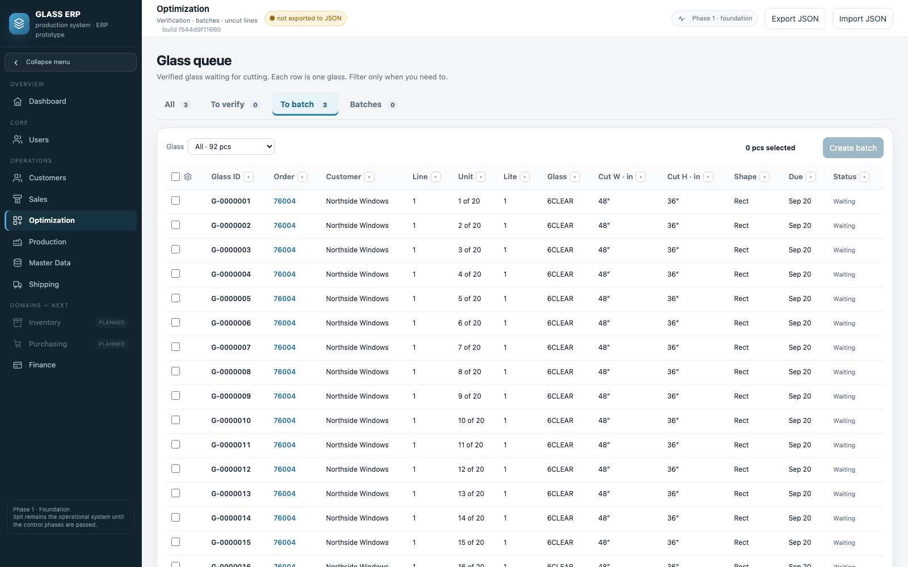
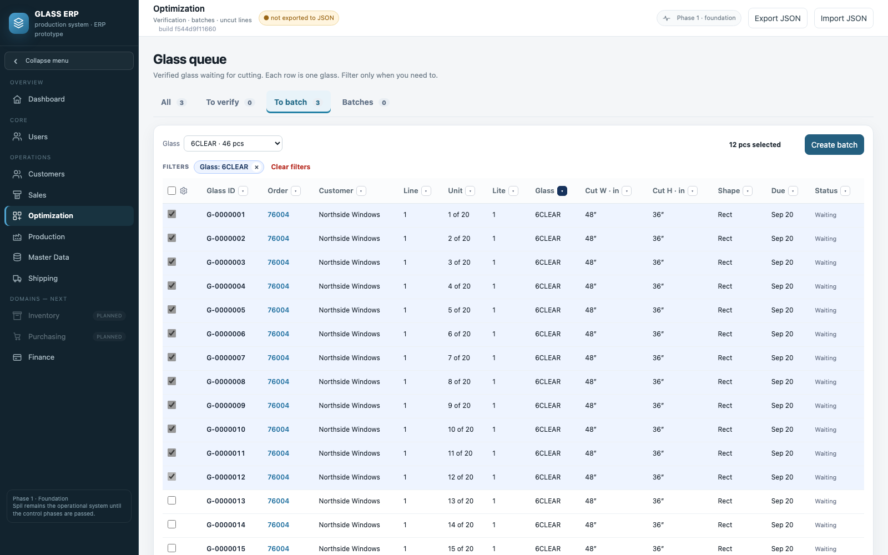
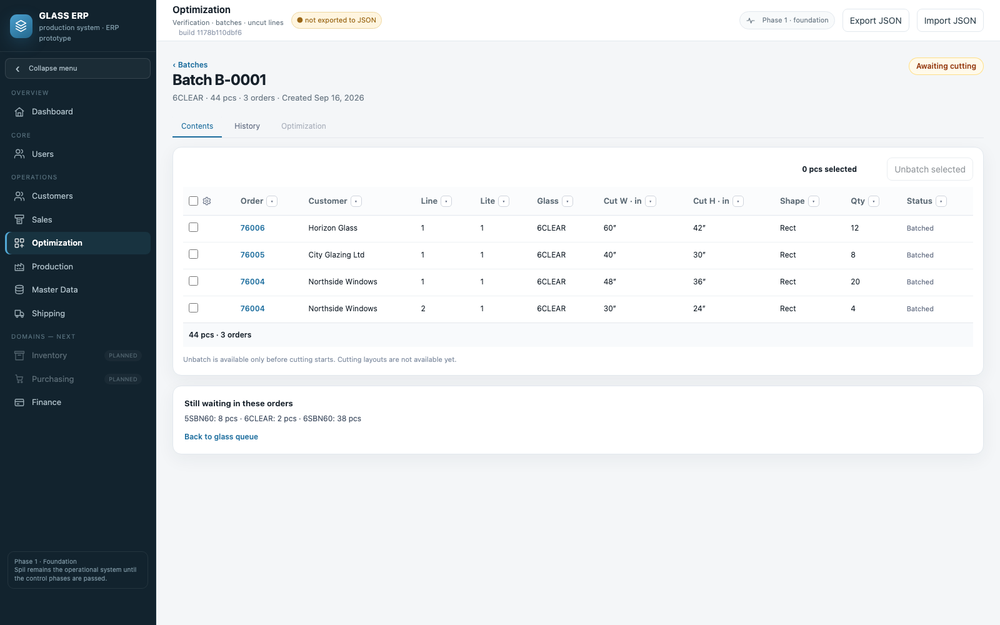
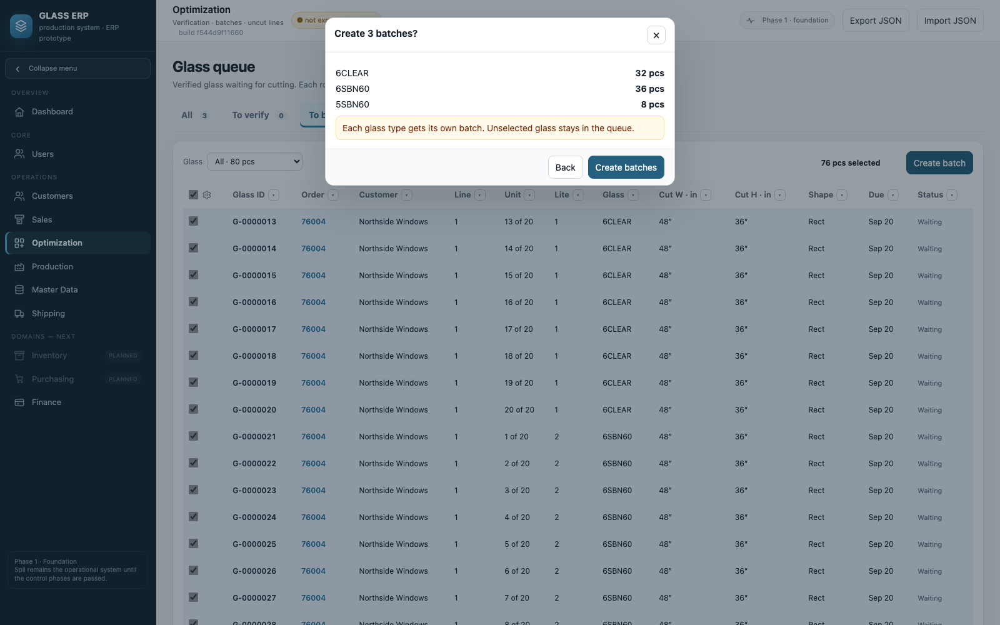
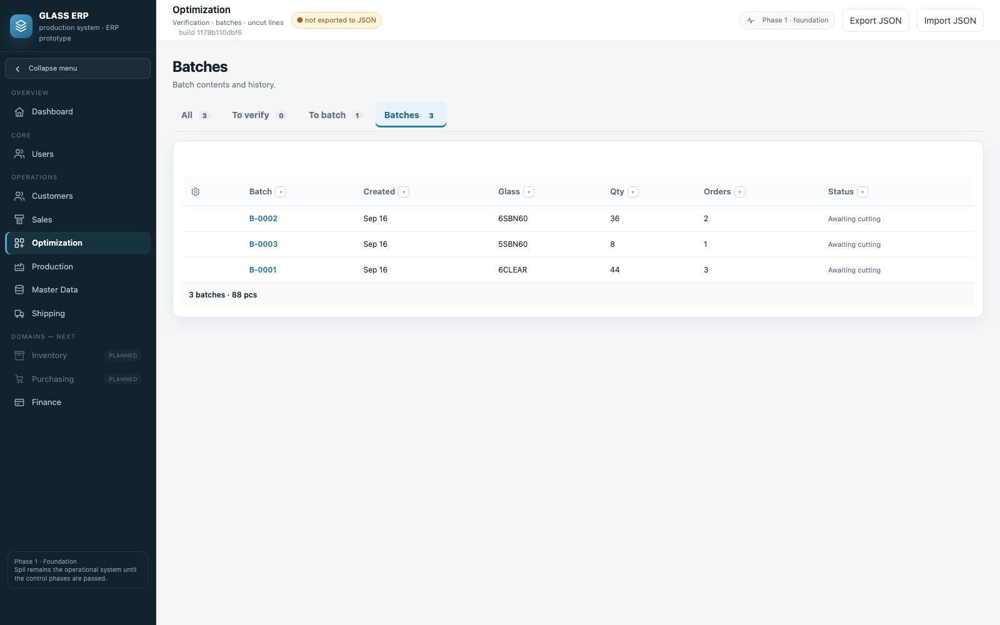
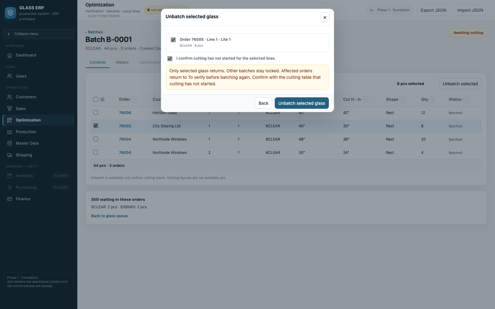
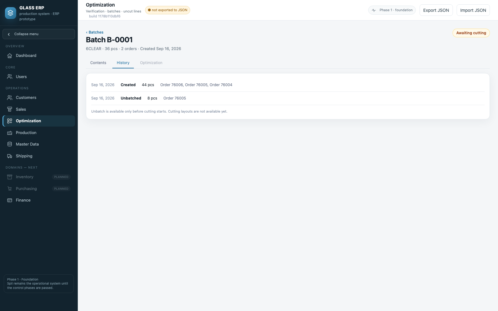
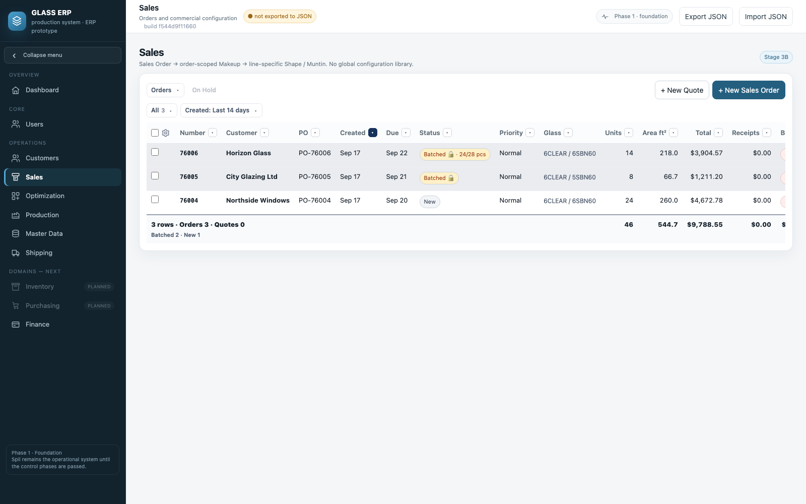
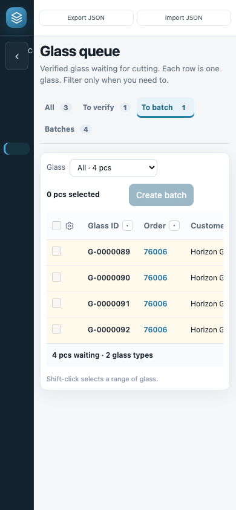

# Проверка батчей отдельных стёкол

Сборка **f544d9f11660** · 17 сентября 2026. Снимки сняты с собранного
`dist/GLASS_ERP.html` на демонстрационных заказах. Макеты одобрены владельцем:
«фильтр по типу не должен быть мандатори» → «делай». После проверки владелец
попросил: «каждый айтем есть объект, который нужно отследить… но информация,
что это стекло 1 из 50, должна быть». Формат номера согласован.
Работу начал Codex; закончена после исчерпания его лимита.

## Glass ID

- Как только заказ **сохранён**, каждое стекло получает постоянный номер
  `G-0000001` (буква G и 7 цифр). Номер не меняется и не выдаётся повторно.
  Владелец: стикер печатают сразу — стекло из стока режут без Verify и батча,
  а сканирование потом отмечает пройденные этапы. Квоте номера не выдаются.
- В штрихкоде будет только этот номер. Место стекла печатается текстом рядом:
  заказ, позиция, изделие **Unit 7 of 50**, Lite. Эти данные берутся из связей.
- Изделий стало больше — новые стёкла получают новые номера. Стало меньше —
  последние номера снимаются, если стекло ещё не в батче.
- Unbatch возвращает стекло в очередь с тем же номером.
- Буквы для будущих объектов: U — стеклопакет, R — стеллаж; B — батч (уже есть).
  Буква G не пересекается с номерами Spil `L-679765`.

## Что проверить

1. Optimization → **To batch**. Одна строка — одно стекло: Glass ID, Order,
   Line, **Unit n of N**, Lite, размеры реза. По умолчанию **Glass: All**.
2. Отметьте первое стекло и с **Shift** — двенадцатое: выбраны 12 из 20.
   **Create batch** — батч B-0001 из 12 стёкол; 8 остаются в очереди.
3. Внизу батча — **Still waiting in these orders**: что ещё ждёт резки.
4. Выберите стёкла нескольких типов → **Create N batches?** — у каждого типа
   свой номер; батчи создаются все вместе или ни один.
5. **Batches** — реестр. Номер открывает состав; **History** — события с
   заказами и номерами стёкол.
6. В составе отметьте стекло → **Unbatch selected** → подтвердите, что резка не
   начата. Возвращается только оно, с тем же Glass ID. Заказ — на Verify.
7. Позиция или заказ на Hold видны в очереди, но не выбираются.
8. В Sales у частичного заказа: **Batched 🔒 · N/M pcs**. Ready, выдача и
   Close закрыты, пока хоть одно стекло не в батче.

## Решения

- Ламинат режется двумя плитами (1a / 1b), как в расчёте кромки.
- Unbatch возвращает заказ на Verify — прежнее правило.
- Старые замки строк и черновые записи «N штук» переносятся в реестр по
  стёклам с номерами, один раз. Уже отправленное стекло не выпускается снова.
- Вкладка Optimization внутри батча выключена: настоящего раскроя пока нет.
- Печать стикеров, сканирование и резка из стока без Verify и батча — следующие этапы.
  Когда появится сканирование, стекло с пройденными этапами нельзя будет снять
  уменьшением количества.

## Проверки

25 проверок в `test/glass-batches.js`: выдача номеров при сохранении, Verify, возврат в New, Cancel/Restore,
рост и уменьшение количества без повторного номера, пример владельца,
несколько типов, дубликаты, изделия «n of N» и ламинат, выбор 12 из 50 через Shift,
Hold, фильтры, депозит и устаревшее окно, Unbatch с тем же номером, начатая
резка, отменённый заказ, перезагрузка, JSON, перенос старых замков и черновых
записей, позиция без Makeup, открытый черновик, английский интерфейс, XSS, телефон.

## Снимки

