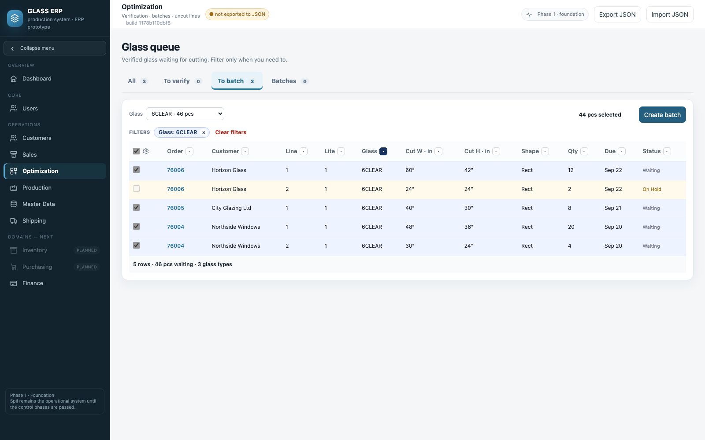
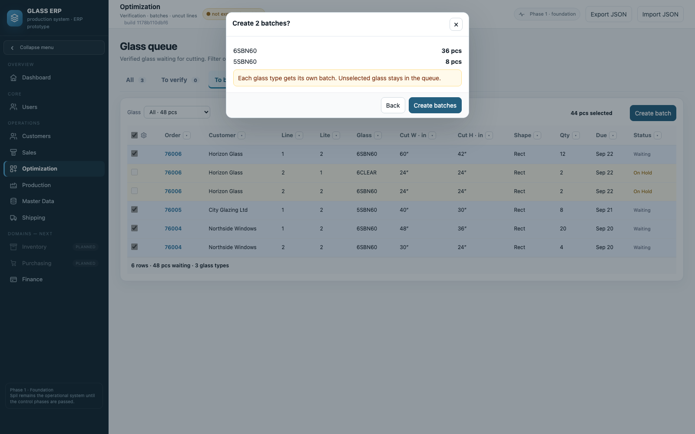

# Проверка батчей отдельных стёкол

Сборка **1178b110dbf6** · 16 сентября 2026. Снимки сняты с собранного
`dist/GLASS_ERP.html` на демонстрационных заказах. Макеты одобрены владельцем:
«выглядит не плохо, но фильтр по типу не должен быть мандатори…» и затем «делай».
Работу начал Codex; закончена после исчерпания его лимита.

## Что проверить

1. Optimization → **To batch**. По умолчанию **Glass: All** — видно всё стекло,
   которое ждёт резки, даже 2 штуки. Одна строка = одно стекло позиции (Lite);
   у ламината две плиты, 1a и 1b. Размеры — размеры реза.
2. Выберите **Glass: 6CLEAR**, отметьте строки и нажмите **Create batch**.
   Откроется батч B-0001: состав, количество, заказы и дата. Внизу —
   **Still waiting in these orders**: что из тех же заказов ещё ждёт резки.
3. Вернитесь в To batch: 6SBN60 и 5SBN60 остались проверенными и ждут.
   Выберите их вместе → окно **Create 2 batches?** — у каждого типа свой номер.
4. **Batches** — реестр. Номер открывает состав; **History** — кто и когда
   создан, возвращён, из каких заказов.
5. В составе отметьте стекло и **Unbatch selected** → подтвердите, что резка не
   начата. Возвращается только это стекло; другие батчи и стёкла под замком.
   Заказ возвращается в To verify, как у прежнего Unbatch.
6. Позиция или заказ на Hold видны в очереди, но не выбираются.
7. В Sales у частично отправленного заказа: **Batched 🔒 · 24/28 pcs**. Ready,
   выдача и Close невозможны, пока хоть одно стекло не в батче.

## Решения и что уточнить

- Количество стекла не делится: в батч уходит весь остаток (например, 20 из 20).
  Вопрос «12 из 20 сейчас, 8 потом» остаётся открытым.
- Ламинат режется двумя плитами — так же, как в расчёте кромки заказа.
  Если ламинат покупной и режется целиком — нужно сказать.
- Unbatch отдельного стекла возвращает заказ на Verify (прежнее правило).
  Если при перепланировке листа это лишнее — можно не менять статус.
- Старые батчи и замки при первом открытии переносятся в реестр как
  «Imported legacy batch»; уже отправленное стекло повторно не выпускается.
- Вкладка Optimization внутри батча выключена: настоящего раскроя пока нет.

## Проверки

20 новых проверок в `test/glass-batches.js`: пример владельца из трёх заказов,
несколько типов, дубликаты, одинаковые стёкла и ламинат, Hold, фильтры,
предупреждение о депозите и устаревшее окно, Unbatch стекла, начатая резка,
отменённый заказ, перезагрузка, JSON, перенос старых замков, позиция без Makeup,
открытый черновик, английский интерфейс, XSS, телефон.
Старые тесты переписаны под новую вкладку To batch. Полный набор — 679 проверок.

## Снимки

