# PR B — проверка, батчи и выдача заказов

PR #82, ветка `codex/pr-b-optimization-queue`, база — main после PR #81.
Все изображения ниже — **скриншоты работающего собранного HTML**, не макеты.
До: сборка `2fee9519c277`. После: `fada986398d1`. Данные демонстрационные.

## Optimization: проверка и батчи

Вкладки All, To verify, To batch, Batched; колонки, фильтры, сортировка и
итоги как в Sales. Два выбранных заказа получают общий номер батча.
On Hold требует Release перед Verify или отправкой в батч.

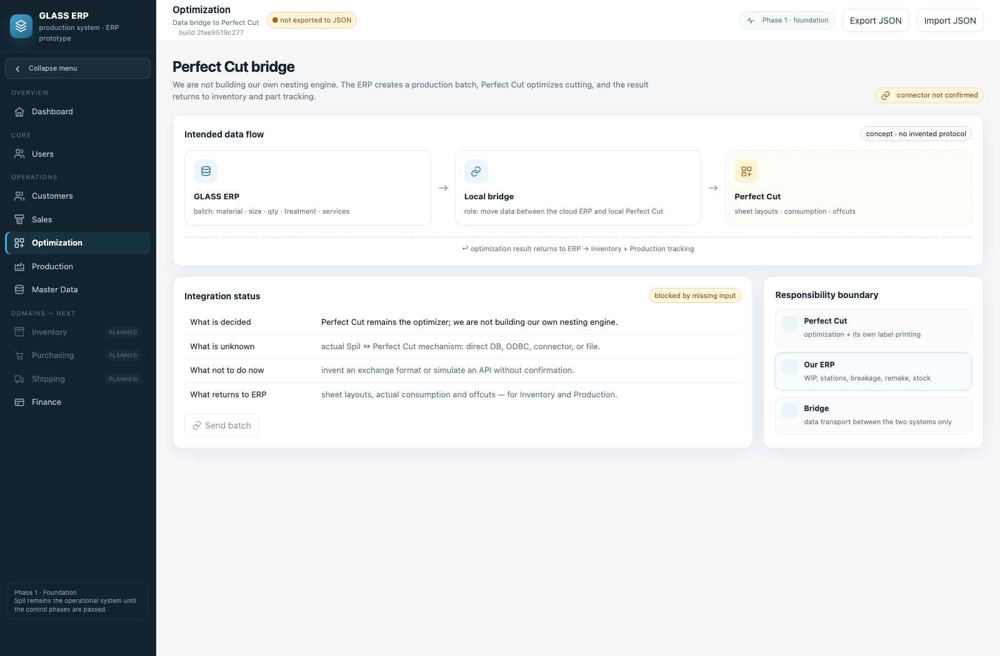
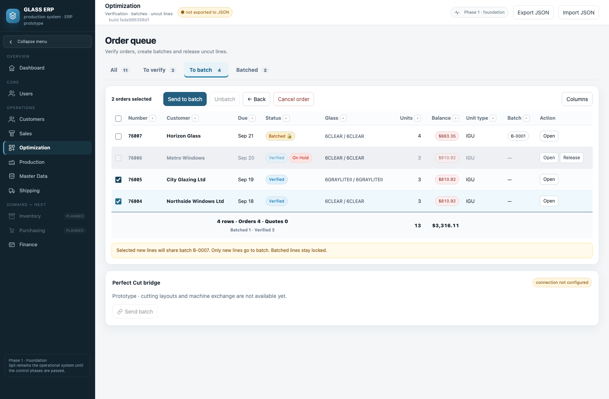

Glass отбирает заказы по отдельному коду из Master Data. All позволяет
сравнить проверенные и непроверенные заказы одного типа стекла. Columns
меняет состав колонок. Настройки трёх экранов сохраняются независимо.

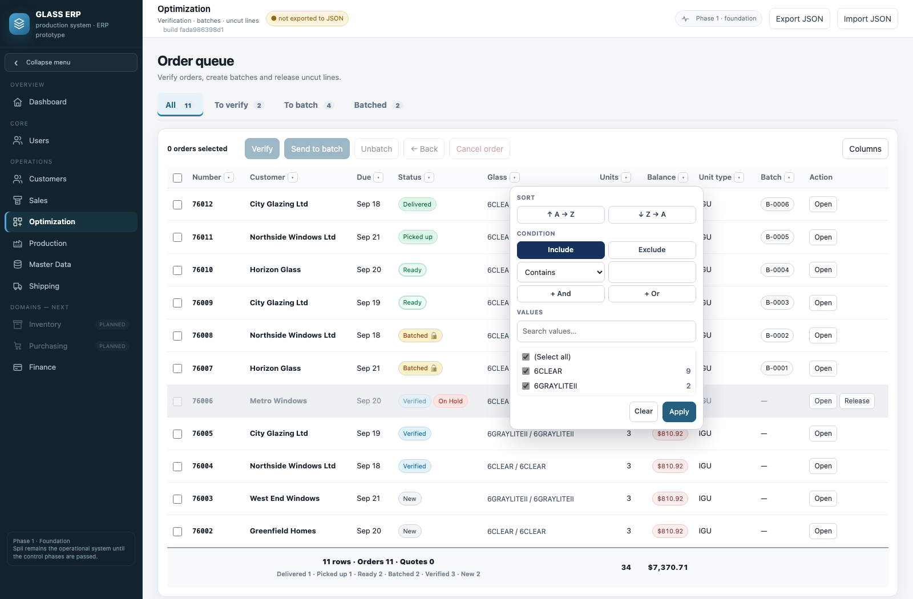
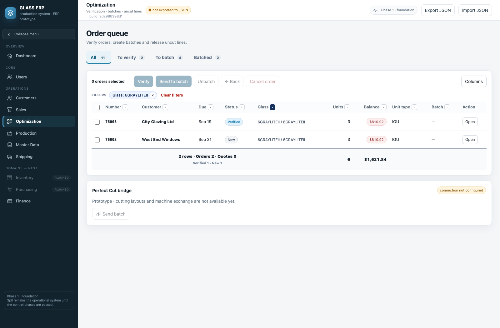

## Shipping: готовность и выдача

Awaiting readiness → Mark ready; Ready → Mark picked up / Mark delivered;
Picked up / Delivered → Close order. До подключения событий цеха сотрудник
вручную подтверждает готовность. Предупреждения об оплате сохранены;
Take payment ведёт в Finance на конкретный заказ и сумму.

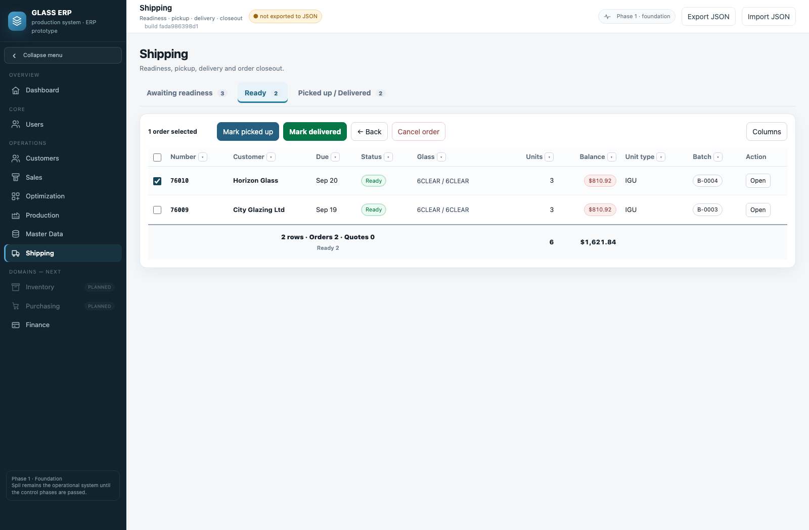
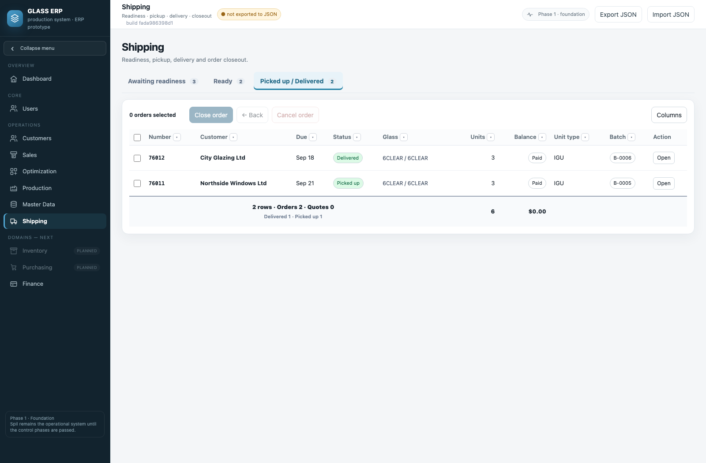
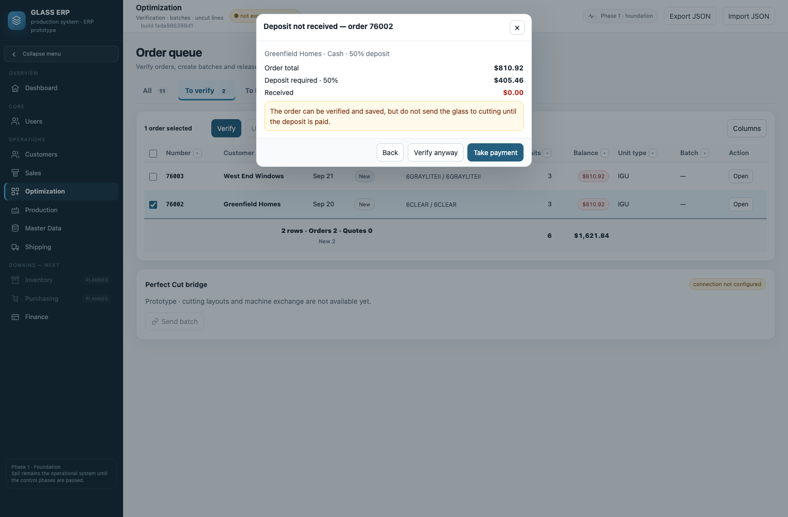

## Unbatch до начала резки

В Optimization выбрать заказ → Unbatch → выбрать строки → подтвердить,
что резка выбранных строк ещё не началась. Только эти строки становятся
редактируемыми. Заказ возвращается в New: правки → Verify → новый батч.
Остальные строки сохраняют замки и номера батчей. В заказе видно событие
Unbatch; прежние номера остаются в истории и не используются повторно.

Если в данных уже отмечено начало резки, Unbatch строки запрещён. Пока
события стола не подключены, отсутствие отметки не доказывает, что резки не
было: требуется подтверждение сотрудника. Обычный Back из Batched запрещён.

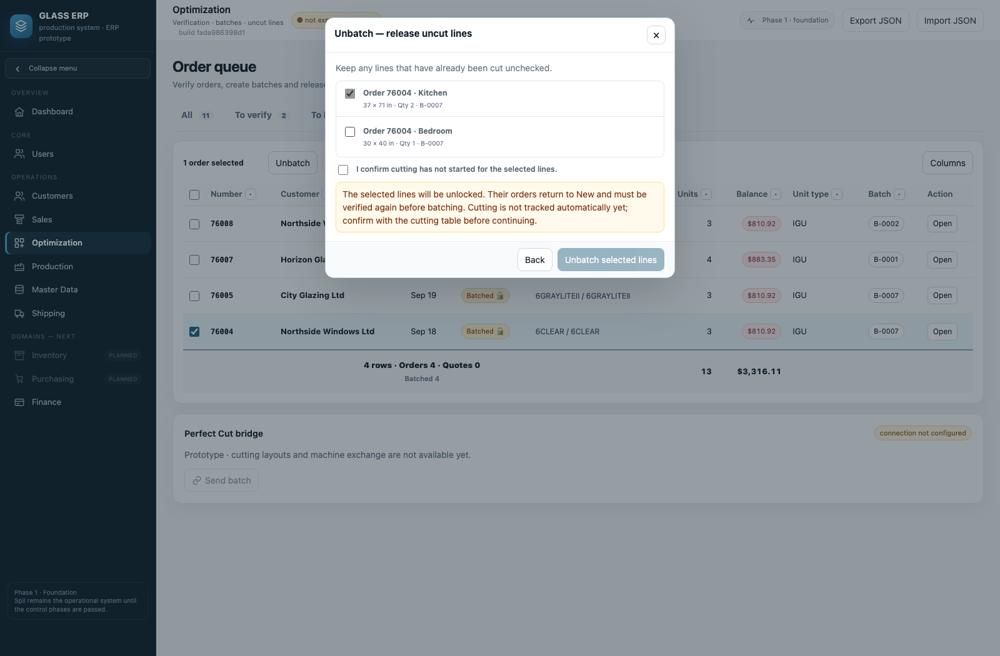
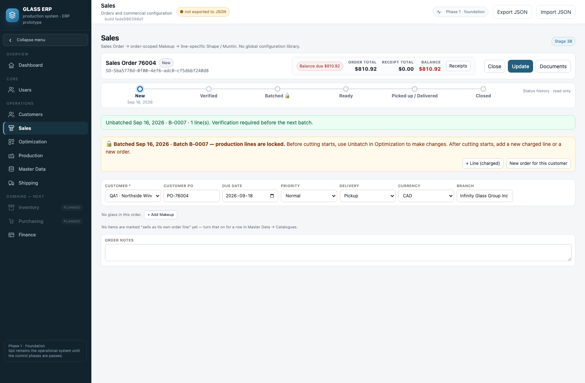

## Заказ — до / после

Кнопки переходов убраны. История этапов, номер батча и замки строк видны.
Close в шапке закрывает редактор; Close order в Shipping закрывает заказ.

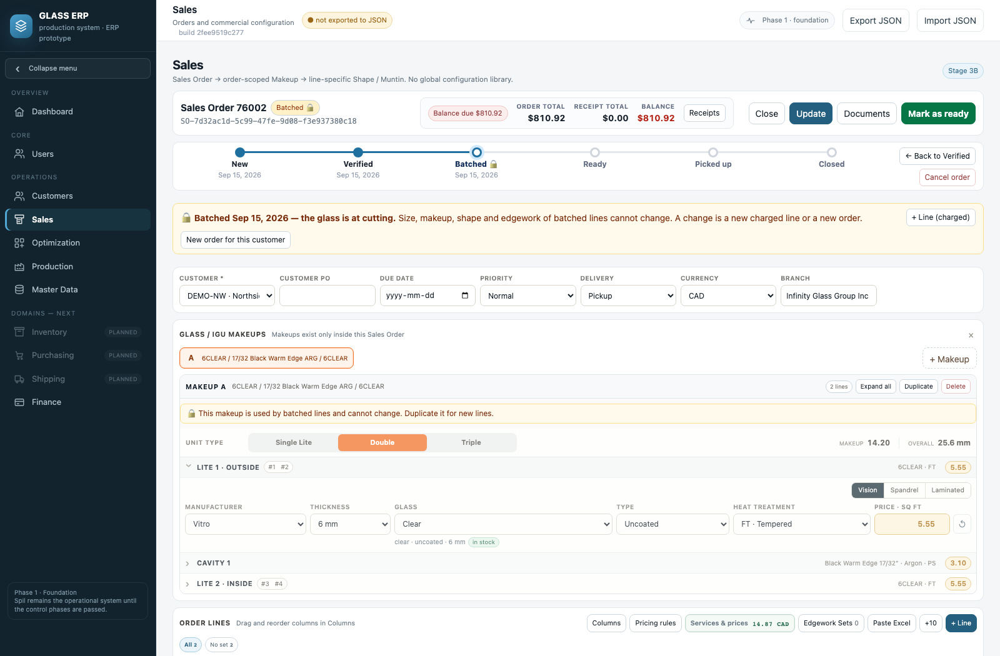
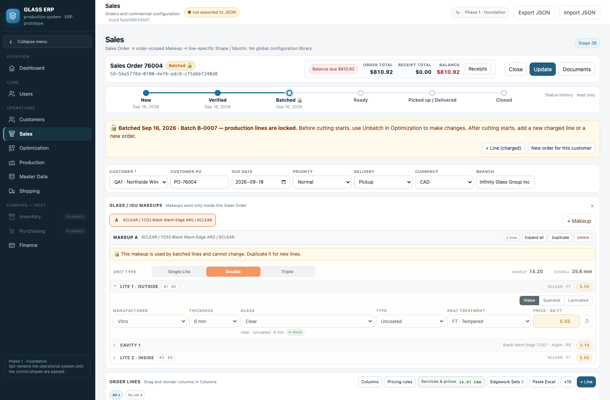

## Как проверить

1. Optimization → All → Glass: выбрать код. Сравнить New / Verified; изменить
   Columns, сортировку и фильтр Status. Открыть Shipping: его вид независим.
2. To verify: выбрать заказ → Verify. При отсутствии депозита проверить
   Back, Verify anyway и Take payment.
3. To batch: отметить два заказа → Send to batch. В Batched общий номер,
   в заказе строки под замком. On Hold требует Release.
4. Batched → Unbatch: снять одну галочку, подтвердить отсутствие резки.
   В заказе выбранная строка доступна, другая заблокирована. После правок
   снова Verify и Send to batch; новая строка получает новый номер.
5. Shipping → Awaiting readiness → Mark ready; Ready → Mark picked up или
   Mark delivered. При долге проверить предупреждение выбранного способа.
6. Picked up / Delivered → Close order. Sales → правой кнопкой по отменённому
   заказу → Restore as New; ранее запущенные строки сохраняют замок.

Набор: **635 проверок**. Покрыты массовые действия без частичного выполнения,
финансы, On Hold, оба способа выдачи, фильтры, частичный Unbatch, повторная
проверка, защита начатой резки, устаревшие окна, JSON, XSS и узкий экран.
Заливка — `node tools/prepush.js` с проверкой исходников и собранного файла,
манифеста, воспроизводимости и переносов строк. `dist` не входит в PR.
