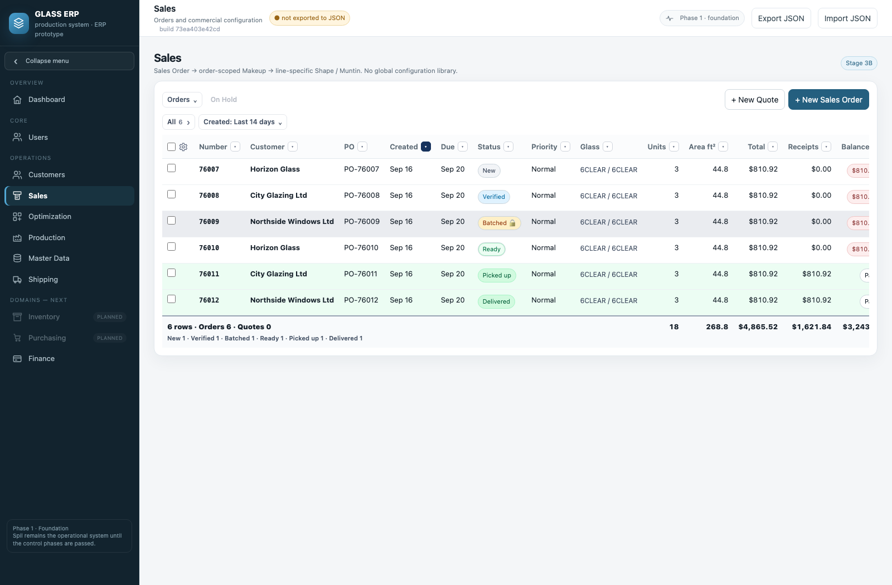
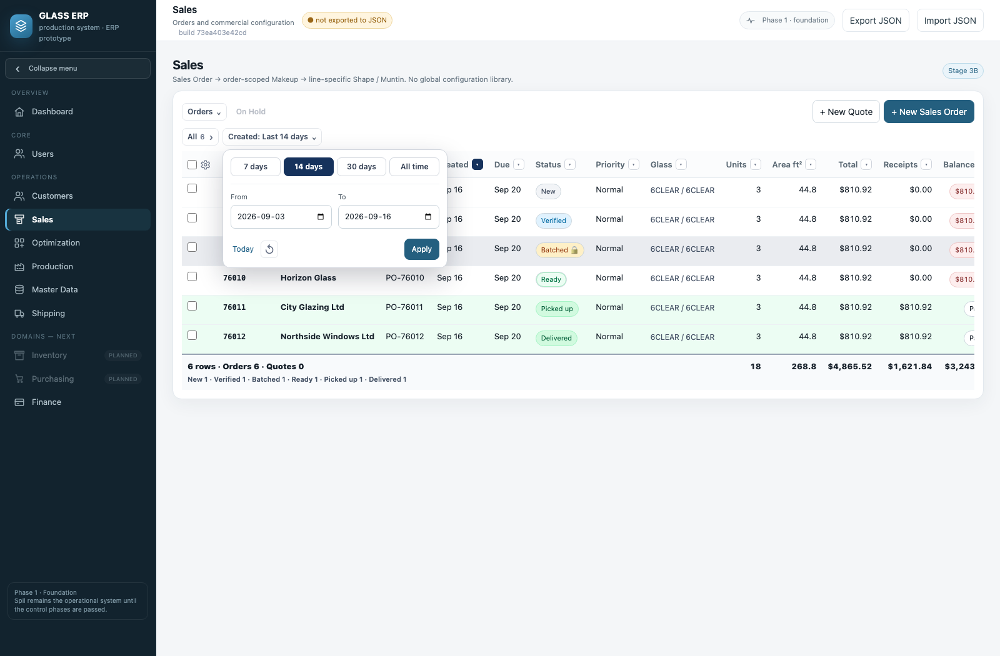
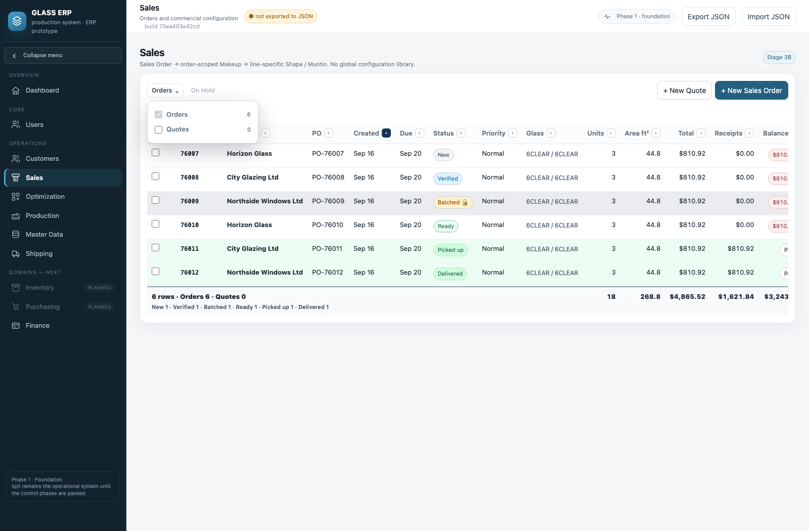
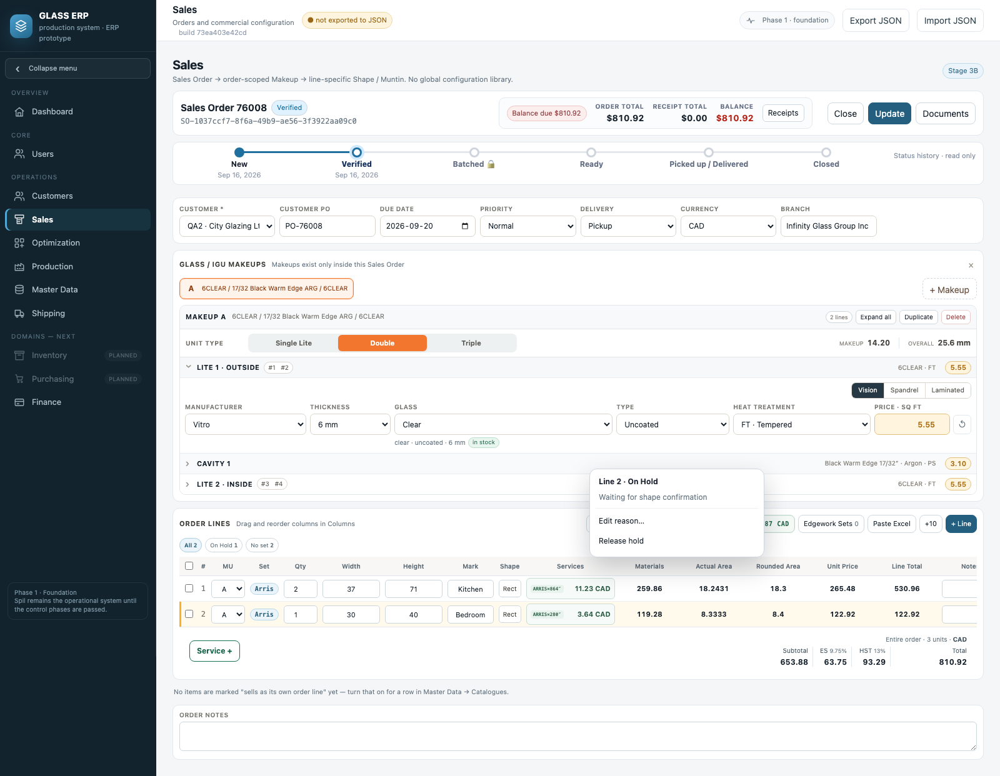
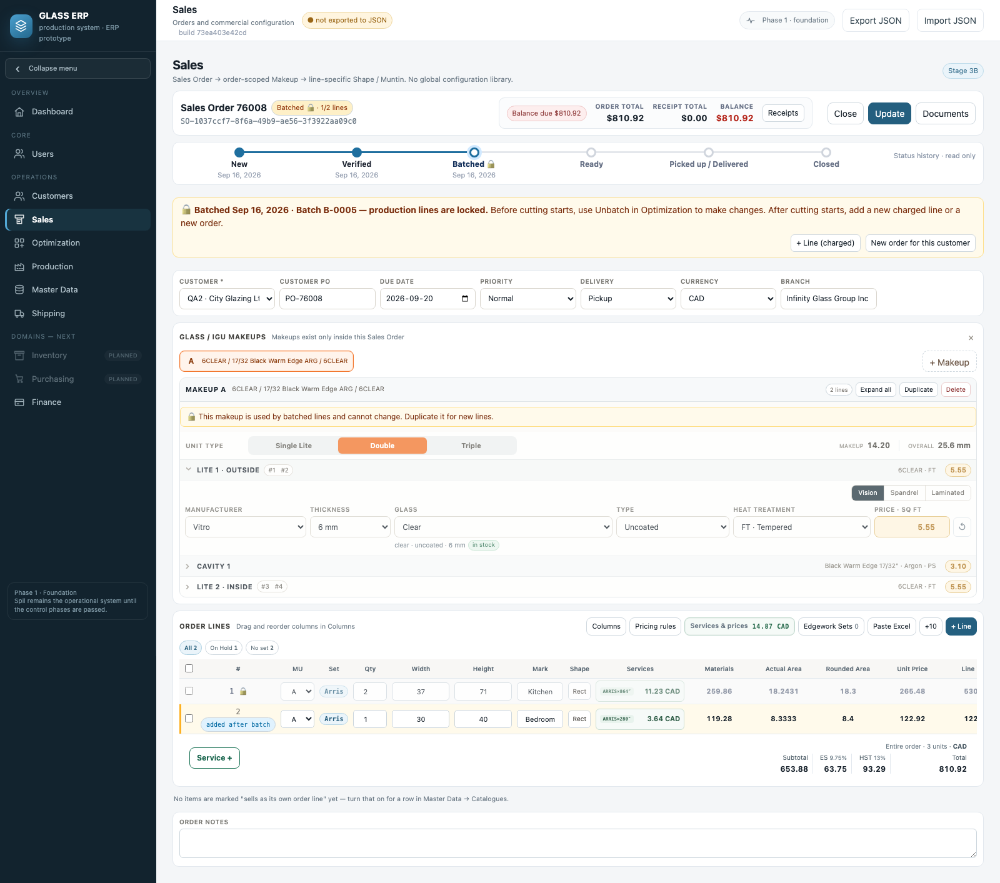
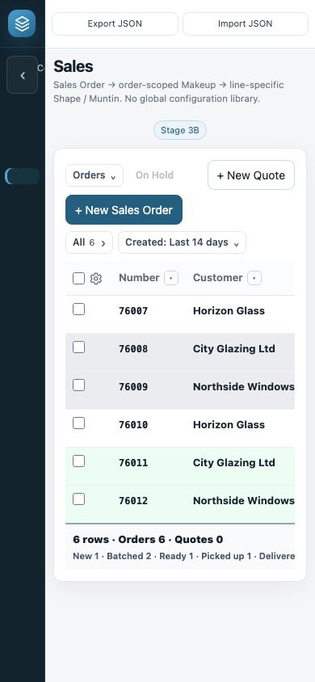

# Проверка компактного Sales

Сборка **73ea403e42cd** · 16 сентября 2026. Снимки сняты с собранного HTML,
с демонстрационными заказами. Макеты одобрены владельцем перед реализацией.

## Что проверить

1. В Sales откройте Orders: переключите Orders/Quotes. Хотя бы один тип остаётся выбранным.
2. Откройте Created: выберите 7/14/30 дней или From/To и Apply. Today заполняет To,
   ↺ очищает период. Начальное значение — 14 дней; существующий фильтр Created сохраняется.
3. All со стрелкой раскрывает статусы. Выбранный статус остаётся виден после сворачивания.
4. Шестерёнка около галочки в шапке открывает прежнюю настройку Columns.
5. Выданные/доставленные заказы зелёные; On Hold заказа сохраняет красную подсветку.
6. Внутри сохранённого заказа нажмите правой кнопкой на свободную позицию → On Hold…;
   укажите причину. На клавиатуре — Shift+F10, на сенсорном экране — долгое нажатие
   на свободную часть строки. Через то же меню доступны Edit reason и Release hold.
7. После Verify отправьте заказ в батч через Optimization: удержанные позиции остаются
   ждать, остальные блокируются как прежде. Ready невозможен, пока есть небатченные позиции.
   После Release hold остаток можно отправить отдельным батчем.

Hold позиции сохраняется сразу, не сохраняет другие несохранённые изменения заказа.
Новая несохранённая позиция получает Hold в черновике до обычного Save.
Позиции, уже ушедшие в батч, нельзя изменить этим меню; для них действует прежний Unbatch.
Обычная невыбранная позиция сама не становится Hold. Размер 1×1 не включает Hold автоматически.

Компонентные батчи (например, только 6CL внутри стеклопакета) и реестр батчей — следующий этап.

## Проверки

24 новых проверки: даты и часовые пояса, фильтры, видимость статуса, выбор типа,
Hold/Release, сохранение и перезагрузка, частичный батч, устаревшее подтверждение,
восстановление полностью заблокированного заказа, 96 из 100 позиций, мобильный вид.
Полный набор содержит 659 проверок и запускается prepush по src и собранному dist.

## Снимки сборки

